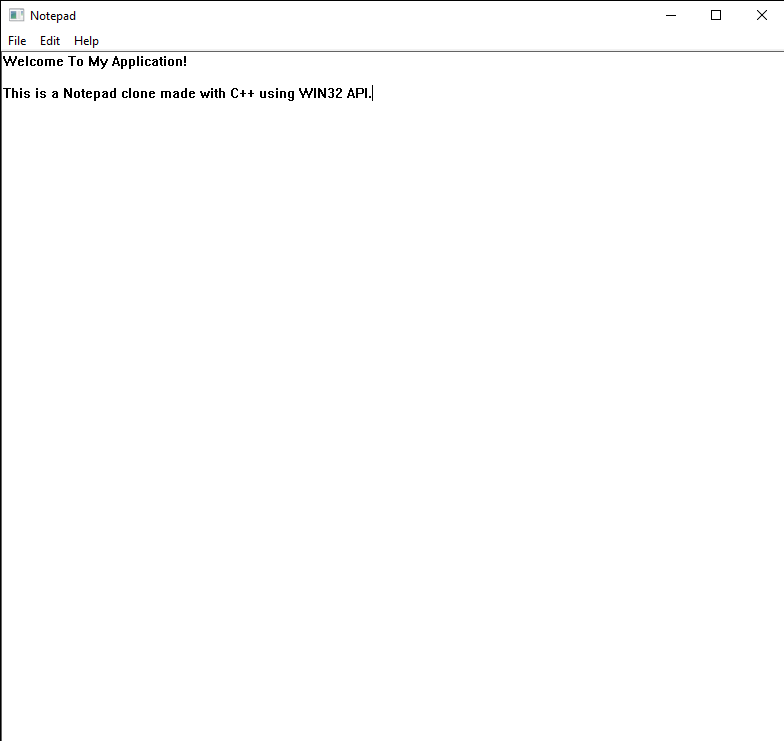

-blue)

<h3>A clone of notepad made with C++ using WIN32 API.</h3>

 

<h2>Installation</h2>

<h4>Just clone git repo, and run it.</h4>

<h4>Made by ~cM</h4>
<h5>Other links : </h5>
<a href="https://discord.gg/5W4XtHkc6g">Discord</a>

